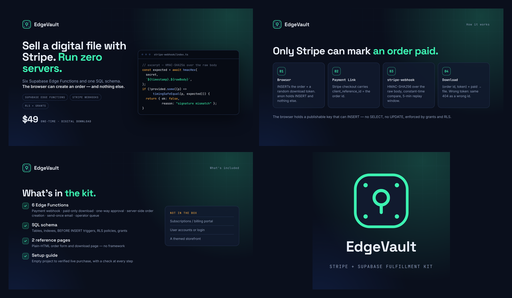
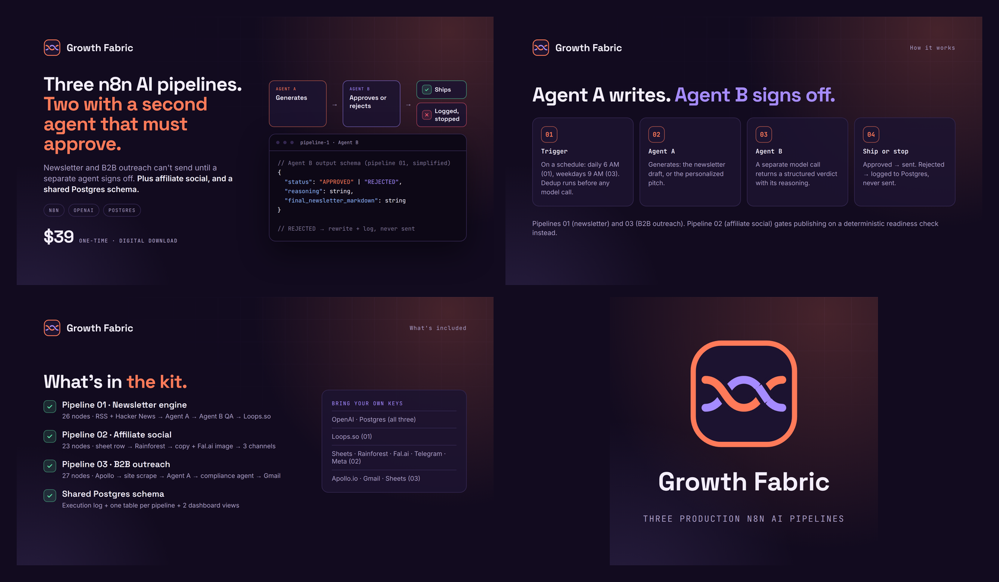
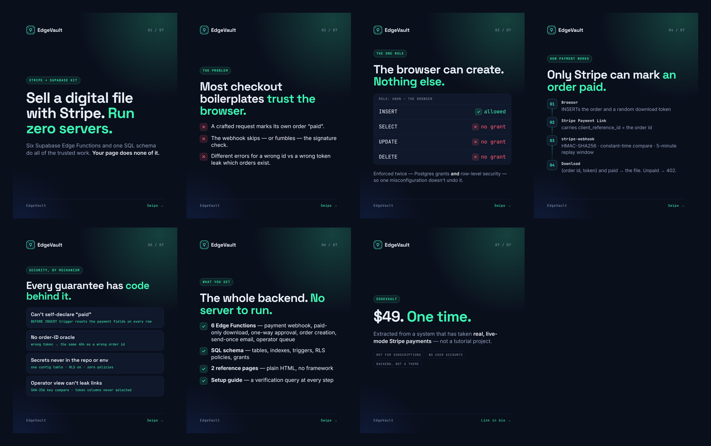
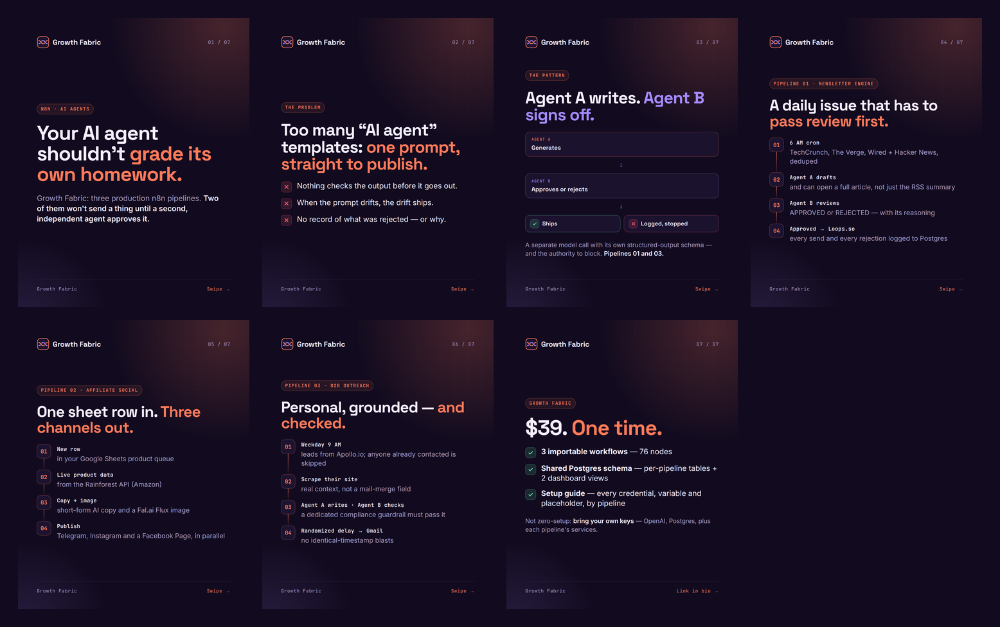

# Master blueprint — EdgeVault & Growth Fabric

The one document to launch from. It ties together the audit, both product
packages, the brand system, every Gumroad and Instagram asset, the queued
Higgsfield work, and — first — what still stands between each product and
its first sale.

*Status as of 2026-09-25.*

---

## 0. Recap

| Step | Where | State |
|---|---|---|
| Audit: find sellable code in this repo (60 days, 135 commits) | `AUDIT.md`, PR #101 | Merged |
| Asset 1 package — **EdgeVault**, Stripe + Supabase fulfillment kit, **$49** | `edgevault-fulfillment-kit/`, PR #101 | Merged |
| Asset 2 package — **Growth Fabric**, three n8n AI pipelines, **$39** | `n8n-growth-fabric/`, PR #105 | Merged |
| Brand system, Gumroad + Instagram assets, this blueprint | `brand/`, this file | This PR |
| Corrections to both packages (see below) | the package docs | This PR |
| Higgsfield marketplace cards | `brand/higgsfield-cards.sh` | Queued: needs credits + login |

**Corrections made in this PR.** Building slides from the package copy meant
re-checking every claim against the source, and some of my earlier copy
didn't survive:

- *Growth Fabric* said all three pipelines have a second, approving agent.
  Only 01 and 03 do; 02 has one LLM call and a non-empty-copy check.
- It also said pipeline 02 never double-posts and only marks a row `LIVE`
  once publishing is confirmed. Neither is true today (see §1).
- Its setup guide missed four required values: `TELEGRAM_CHANNEL_ID`, the
  Amazon affiliate tag, and two sheet ids. It also sent buyers to the wrong
  place to debug. Every `$vars` and `YOUR_…` token is now listed, and a
  script cross-check confirms all 15.
- The Growth Fabric listing's "eight of ten templates" line was an invented
  statistic. It's gone.
- *EdgeVault*'s file list named `001_initial_schema.sql`, which belongs to
  another project. The kit's real schema only exists as SQL in
  `docs/crf/BLUEPRINT.md` §3.

---

## 1. Launch blockers

Neither product can be listed today. EdgeVault is closer.

### EdgeVault — the release build doesn't exist yet

The package docs describe a zip that hasn't been assembled. In order:

1. **New repo or folder, not this monorepo.** Copy the six Edge Functions
   (`stripe-webhook`, `kit-download`, `apparel-approval`,
   `create-apparel-order`, `apparel-notify`, `admin-orders`).
2. **Rename `crf_` to the `{{PREFIX}}_` placeholder** across the SQL and all
   six functions, as `SETUP.md` promises. Rename the apparel-specific
   functions and strings too: `kit-download`'s attachment filename is still
   `crf250l-kit-<id>.svg`.
3. **Assemble one migration, `0001_schema.sql`,** from `docs/crf/BLUEPRINT.md`
   §3 (tables, indexes, triggers, RLS, grants) plus the racewear trigger in
   `supabase/migrations/003_crf_racewear_order_security.sql`. Do not ship
   `001_initial_schema.sql`; it belongs to a different project.
4. **Write the two reference pages** (`client-pattern/order-form.html`,
   `download.html`). The README lists them, but they don't exist yet. Derive
   them from the order and download flow in `crf-builder/index.html`, with
   no CRF or Honda copy (trademark exposure, per `docs/crf/SYSTEM.md` §11).
5. **Run `SETUP.md` end to end** on a fresh Supabase project in Stripe test
   mode, then do one live purchase and a refund. Fix the guide wherever
   reality disagrees with it.
6. **Fill in the listing placeholders.** These are yours to decide (§9).

### Growth Fabric — the workflows have defects

The package's README now lists these under *Known limitations*. Fix them,
then delete that section.

1. **The duplicate check can't match** (pipeline 02). It compares the sheet's
   raw `product_url` against a stored `https://www.amazon.com/dp/<ASIN>?tag=…`.
   Compare the same canonical form on both sides.
2. **SQL is built from interpolated strings.** `prospect_email` and
   `corporate_website` come from Apollo (third-party data) and aren't
   escaped, and neither is the sheet's product URL. Move every value to the
   Postgres node's query parameters. This is the most serious item on this
   list.
3. **`LIVE` after a failed publish** (pipeline 02). Every publish node
   continues on failure. Gate `Mark Row LIVE` on per-channel success.
4. **The error branches are inert.** No workflow sets an error workflow.
   `SETUP.md` now covers the manual fix; decide whether that's enough.
5. **`tokens_consumed` is always 0.** Populate it, or stop showing token
   spend.
6. **None of the three has been run end to end,** as far as this repo shows:
   one commit, no iteration. Run each once with real credentials before
   selling.

**Sequencing:** launch EdgeVault first. Hold Growth Fabric until its fixes
land and EdgeVault has sold; that also sets up the $69 bundle in its pricing
doc.

---

## 2. Brand system

Two products, one studio. They share type, grid and voice, so they read as
siblings in one Gumroad store. Accent colour and mark tell them apart.

### Shared

| | |
|---|---|
| Display | **Space Grotesk** 600–700, tight tracking (−0.028em), accent-coloured tail on headlines |
| Body | **Inter** 400–600 |
| Labels & code | **JetBrains Mono** 500–600, uppercase labels with wide tracking, ligatures off so code shows as written |
| Ground | Dark, with a faint grid fading in from the top right and two soft colour glows |
| Furniture | Mono "kicker" chip above headlines · counter top right · footer rule with a *Swipe →* / *Link in bio →* cue |
| Fonts | All OFL. `build.py` fetches them from npm (Fontsource); nothing is committed |

**Voice rules.** They apply to both products and to anything generated
later:

- Claim by mechanism, not by adjective. Write "HMAC-SHA256, constant-time
  compare", not "bank-grade security".
- No invented statistics, testimonials, ratings or user counts.
- Say who it's *not* for, on the listing and in the carousel.
- Every claim traces to a line of source. If it can't, cut it.

### EdgeVault

| Role | Hex |
|---|---|
| Ink (ground) | `#0A0F1C` |
| Panel | `#111A2E` |
| Line | `#22304D` |
| Text / muted | `#E8EEF9` / `#8C9BB8` |
| **Signal mint** — verified, paid, accent | `#3CF2B1` |
| Vault amber — pending, 402 | `#FFB547` |
| Error | `#FF5C72` |
| Secondary glow | `#2F6BFF` |

**Mark:** a vault door, drawn as a rounded square with four bolts and a
keyhole where the dial would be. **Voice:** calm, precise and
security-literate.

### Growth Fabric

| Role | Hex |
|---|---|
| Aubergine (ground) | `#120B1F` |
| Panel | `#1C1330` |
| Line | `#33264F` |
| Text / muted | `#F4EEFF` / `#A99CC4` |
| **Coral — thread A**, the generating agent | `#FF7A59` |
| **Violet — thread B**, the approving agent | `#A58BFF` |
| Approved / rejected | `#5BE3A6` / `#FF5C72` |

**Mark:** two threads, genuinely woven. A crosses over B on the left and B
over A on the right: two agents, neither one on top. **Voice:** practical
and operator-level, and honest about the setup work.

---

## 3. Gumroad package

Gumroad recommends a cover image of at least 1280×720 and a square
thumbnail of at least 600×600 (check the product editor; specs change).
Everything here is rendered at 2× those sizes.

### EdgeVault



| Slot | File | Size |
|---|---|---|
| Thumbnail | `brand/edgevault/gumroad/thumbnail.png` | 1200×1200 |
| Cover 1 | `brand/edgevault/gumroad/cover.png` | 2560×1440 |
| Cover 2 | `brand/edgevault/gumroad/how-it-works.png` | 2560×1440 |
| Cover 3 | `brand/edgevault/gumroad/whats-included.png` | 2560×1440 |

Listing copy: `edgevault-fulfillment-kit/GUMROAD_LISTING.md` · Price: `$49`
one-time · Pricing rationale: `edgevault-fulfillment-kit/PRICING_STRATEGY.md`.

### Growth Fabric



| Slot | File | Size |
|---|---|---|
| Thumbnail | `brand/growth-fabric/gumroad/thumbnail.png` | 1200×1200 |
| Cover 1 | `brand/growth-fabric/gumroad/cover.png` | 2560×1440 |
| Cover 2 | `brand/growth-fabric/gumroad/how-it-works.png` | 2560×1440 |
| Cover 3 | `brand/growth-fabric/gumroad/whats-included.png` | 2560×1440 |

Listing copy: `n8n-growth-fabric/GUMROAD_LISTING.md` · Price: `$39`
one-time · Pricing rationale: `n8n-growth-fabric/PRICING_STRATEGY.md`.

### Listing checklist (both)

- [ ] Name, summary (the one-line pitch) and description, pasted from the
      listing doc
- [ ] Cover images in the order above, then the thumbnail
- [ ] Product file: the **release zip**, not a link to this repo
- [ ] Price, with no fake "was" price (see the pricing docs)
- [ ] License text, and a refund policy that states plainly what it covers
- [ ] Support email set, and it actually reaches you
- [ ] One test purchase through Gumroad's own checkout before you announce
      anything

---

## 4. Instagram package

Portrait carousels, 1080×1350, seven slides each. Each slide's alt text is
its headline; paste it into Instagram's *Advanced settings → Accessibility*.

### EdgeVault



| # | Role | Headline |
|---|---|---|
| 01 | Hook | Sell a digital file with Stripe. Run zero servers. |
| 02 | Problem | Most checkout boilerplates trust the browser. |
| 03 | The rule | The browser can create. Nothing else. |
| 04 | How it works | Only Stripe can mark an order paid. |
| 05 | Proof | Every guarantee has code behind it. |
| 06 | What you get | The whole backend. No server to run. |
| 07 | Offer | $49. One time. |

**Caption**

```
Selling a digital file shouldn't mean running a server.

EdgeVault is a Stripe + Supabase kit where the browser can create an order — and nothing else. Only a signature-verified Stripe webhook can mark it paid. A wrong token gets the same 404 as a wrong order id.

→ 6 Supabase Edge Functions
→ SQL schema: tables, triggers, RLS, grants
→ 2 plain-HTML reference pages
→ Setup guide with a verification query at every step

$49, one time. Link in bio.

#supabase #stripe #edgefunctions #serverless #postgres #webdev #devtools #indiehackers #buildinpublic
```

### Growth Fabric



| # | Role | Headline |
|---|---|---|
| 01 | Hook | Your AI agent shouldn't grade its own homework. |
| 02 | Problem | Too many "AI agent" templates: one prompt, straight to publish. |
| 03 | The pattern | Agent A writes. Agent B signs off. |
| 04 | Pipeline 01 | A daily issue that has to pass review first. |
| 05 | Pipeline 02 | One sheet row in. Three channels out. |
| 06 | Pipeline 03 | Personal, grounded — and checked. |
| 07 | Offer | $39. One time. |

**Caption**

```
Your AI agent shouldn't grade its own homework.

Growth Fabric is three production n8n pipelines: newsletter engine, affiliate social, B2B outreach. In the newsletter and outreach pipelines, a second, independent agent has to approve the draft before anything sends — rejections are logged with the reason, never sent.

→ 3 importable workflows, 76 nodes
→ Shared Postgres schema + 2 dashboard views
→ Setup guide: every credential, variable and placeholder, by pipeline

Not zero-setup: bring your own OpenAI, Postgres and service keys.

$39, one time. Link in bio.

#n8n #automation #aiagents #workflowautomation #nocode #openai #postgres #indiehackers #buildinpublic
```

### Posting plan

Tie each post to a listing that's live. Don't announce a product people
can't buy yet.

| When | EdgeVault | Growth Fabric |
|---|---|---|
| Launch day | Carousel + link in bio → listing | — |
| +2 days | Slide 03 as a single post ("The browser can create. Nothing else.") | — |
| +5 days | Slide 05 as a single post | — |
| After its fixes ship | — | Carousel, then slide 03 as a single post |
| Once both have sold | Bundle post ($69), from the Growth Fabric pricing doc | ← same |

---

## 5. Higgsfield marketplace cards (queued)

**Status: not generated.** The account held **0.25 credits** and the CLI in
this environment isn't logged in. Marketplace cards run on `nano_banana_2`
at **1.5 credits each** (preflighted), so the planned set of 7 per product
comes to **about 21 credits**.

`brand/higgsfield-cards.sh` is ready. It passes each product's `keyart.png`
as the reference image, a short intent as `--prompt`, and the palette, fonts
and product facts as context flags. The backend writes the actual image
prompts.

| Generated | Skipped, and why |
|---|---|
| `main_image`, `infographic`, `whats_in_box`, `aplus_hero_banner`, `aplus_pain_points`, `aplus_features`, `aplus_how_to_use` | `aplus_endorsement`: no testimonials exist, so a generated one would be a fake review. `multi_angle`, `detail_shot`, `aplus_ingredients`, `aplus_efficacy`: physical-goods modules, meaningless for a download. |

To run it:

```bash
higgsfield auth login                           # once; plus: higgsfield workspace set <id> if asked
productized/brand/higgsfield-cards.sh --preview # free: enhanced prompts only, no images
productized/brand/higgsfield-cards.sh           # ~21 credits; logs + urls.txt under brand/<product>/higgsfield/
```

The generation path hasn't been exercised: the script has only been
syntax-checked and seen to refuse cleanly without a login. Review the
`--preview` output before spending credits. Download the keepers next to the
log, because generation URLs aren't permanent. These are *extra* gallery
images; the typeset covers above stay the primary set, because they're the
ones guaranteed to spell the price right.

---

## 6. Launch sequence

1. **EdgeVault release build** (§1). It's the only step with real
   engineering left.
2. **Listing:** assets from §3, copy from the listing doc, then one test
   purchase.
3. **Announce:** the Instagram plan in §4.
4. **Optional:** Higgsfield gallery images (§5), once credits are topped up.
5. **Growth Fabric:** fix §1's list, run each pipeline once for real, then
   repeat steps 2–3.
6. **Bundle:** once both have independent sales history.

---

## 7. Asset inventory

```
productized/brand/
  build.py                          renders everything below
  higgsfield-cards.sh               queued marketplace cards (§5)
  edgevault/
    keyart.png                      1024×1024   reference image for Higgsfield
    gumroad/thumbnail.png           1200×1200
    gumroad/cover.png               2560×1440
    gumroad/how-it-works.png        2560×1440
    gumroad/whats-included.png      2560×1440
    gumroad/preview.png                         contact sheet
    instagram/01.png … 07.png       1080×1350
    instagram/preview.png                       contact sheet
  growth-fabric/                    same layout
```

---

## 8. Changing and rebuilding the assets

The copy lives in `brand/build.py`: `COPY` for the Gumroad images and
`ig_slides()` for the carousels. Edit it there and rebuild:

```bash
python3 productized/brand/build.py                 # both products, ~40 s
python3 productized/brand/build.py growth-fabric   # one product
```

It needs Python 3.10+, Pillow, npm (fonts, on first run) and a headless
Chromium. It finds Playwright's install automatically; otherwise set
`CHROME_BIN`. **Every image is checked for overflow.** If text runs off the
canvas or a code line gets clipped, the build fails and names the file,
instead of shipping a cut-off headline. A copy change that doesn't fit shows
up there first.

The copy on the images has to stay in step with the listing docs. If you
change a claim in one, change it in the other.

---

## 9. Decisions only you can make

- **Gumroad store name and profile.** Neither product image carries a store
  or company name, so any choice works with the assets as rendered.
- **Support email, refund policy and license text.** Each listing doc has a
  starting point marked "confirm before publishing".
- **Instagram handle.** The carousels say *Link in bio* and name no handle.
- **Whether to spend about 21 Higgsfield credits** on the gallery images in
  §5.
- **EdgeVault's trust line.** It used to say the source system "has taken
  real, live-mode Stripe payments". It hasn't: `docs/crf/SYSTEM.md` shows a
  live-mode payment link, and as of 2026-09-30 that link had recorded no
  purchase. The line now says "wired to a live-mode Stripe payment link".
  Restore the stronger wording only after a real purchase clears, and
  re-render the EdgeVault images first: the committed PNGs still carry the
  old line.
